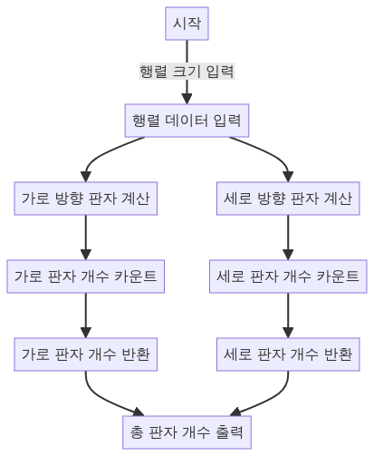

> [CH03_그래프_탐색](../) / [02_DFS](./)

# BOJ_1388 : 바닥 장식
> https://www.acmicpc.net/problem/1388

## 설계
- 각 행과 열을 순회하면서 연속된 판자를 하나로 취급
- 스택을 사용하여 현재 살펴보는 판자가 이전 판자와 같은 종류인지를 확인하고, 다른 종류의 판자가 나타날 때마다 필요한 판자의 개수를 증가
- 가로(`-`)와 세로(`|`) 방향으로 각각의 필요한 판자 개수를 계산하고, 이를 합산하여 전체 필요한 판자의 개수를 구함

## 구현


## 코드
### Java
```java
// package boj1388;

// https://www.acmicpc.net/problem/1388
import java.util.*;
import java.io.*;

public class Main {
    static char[][] matrix; // 바닥 장식을 나타내는 행렬

    public static void main(String[] args) {
        Scanner sc = new Scanner(System.in);
        StringTokenizer st = new StringTokenizer(sc.nextLine());
        int N = Integer.parseInt(st.nextToken()); // 세로 크기 입력 받음
        int M = Integer.parseInt(st.nextToken()); // 가로 크기 입력 받음
        matrix = new char[N][M]; // N x M 크기의 행렬 초기화

        // 행렬에 바닥 장식 데이터 입력
        for (int i = 0; i < N; i++) {
            String line = sc.nextLine();
            for (int j = 0; j < M; j++) {
                matrix[i][j] = line.charAt(j); // 각 문자를 행렬에 저장
            }
        }
        sc.close();

        // 가로 및 세로 방향으로 필요한 판자의 개수 계산
        System.out.println(searchRow() + searchColumn());
    }

    // 가로 방향으로 필요한 판자 개수 계산
    static int searchRow() {
        int count = 0;
        for (int r = 0; r < matrix.length; r++) {
            Stack<Character> stack = new Stack<>();
            for (int c = 0; c < matrix[0].length; c++) {
                // 디버깅용 출력: 현재 위치와 문자 출력
                System.out.print("[" + r + "," + c + "]: " + matrix[r][c] + " ");

                // 스택이 비어있거나 현재 문자가 스택의 최상단 문자와 같을 경우 스택에 추가
                if (stack.isEmpty() || stack.peek() == matrix[r][c]) {
                    stack.push(matrix[r][c]);
                } else {
                    // 다른 문자가 나오면, 스택을 비우고 새 문자 추가
                    if (stack.peek() == '-') {
                        count++; // '-' 판자일 경우 개수 증가
                    }
                    stack.clear();
                    stack.push(matrix[r][c]);
                }
            }
            if (!stack.isEmpty() && stack.peek() == '-') {
                count++; // 마지막 판자 검사
            }
            // 디버깅용 출력: 행의 끝에 도달했을 때
            System.out.println();
        }
        return count;
    }

    // 세로 방향으로 필요한 판자 개수 계산
    static int searchColumn() {
        int count = 0;
        for (int c = 0; c < matrix[0].length; c++) {
            Stack<Character> stack = new Stack<>();
            for (int r = 0; r < matrix.length; r++) {
                // 디버깅용 출력: 현재 위치와 문자 출력
                System.out.print("[" + r + "," + c + "]: " + matrix[r][c] + " ");

                // 위와 같은 방식으로 세로 방향 판자 개수 계산
                if (stack.isEmpty() || stack.peek() == matrix[r][c]) {
                    stack.push(matrix[r][c]);
                } else {
                    if (stack.peek() == '|') {
                        count++; // '|' 판자일 경우 개수 증가
                    }
                    stack.clear();
                    stack.push(matrix[r][c]);
                }
            }
            if (!stack.isEmpty() && stack.peek() == '|') {
                count++; // 마지막 판자 검사
            }
            // 디버깅용 출력: 열의 끝에 도달했을 때
            System.out.println();
        }
        return count;
    }
}
```

### Python
```python
from collections import deque

N, M = map(int, input().split())
print(N, M)

matrix = [list(input()) for _ in range(N)]
print(matrix)

def search_row():
    count = 0
    for r in range(N):
        st = deque()
        for c in range(M):
            # 디버깅: 현재 위치와 문자 출력
            print(f'[{r}, {c}]: {matrix[r][c]}')
            cursor = matrix[r][c]
            # 스택이 비어있거나 현재 문자와 스택의 최상단 문자가 같으면 스택에 추가
            if not len(st) or (st[-1] == cursor):
                st.append(cursor)
            # 다른 문자가 나오면, 스택을 비우고 새 문자 추가
            elif st[-1] != cursor:
                if st[-1] == '-':
                    count += 1  # '-' 판자일 경우 개수 증가
                st = deque()
                st.append(cursor)
        # 마지막 판자 검사
        if len(st) and st[-1] == '-':
            count += 1
        print()
    print(f'horizontal : {count}')
    return count

def search_column():
    count = 0
    for c in range(M):
        st = deque()
        for r in range(N):
            # 디버깅: 현재 위치와 문자 출력
            print(f'[{r}, {c}]: {matrix[r][c]}')
            cursor = matrix[r][c]
            # 위와 같은 방식으로 세로 방향 판자 개수 계산
            if not len(st) or (st[-1] == cursor):
                st.append(cursor)
            elif st[-1] != cursor:
                if st[-1] == '|':
                    count += 1  # '|' 판자일 경우 개수 증가
                st = deque()
                st.append(cursor)
        # 마지막 판자 검사
        if len(st) and st[-1] == '|':
            count += 1
        print()
    print(f'vertical : {count}')
    return count

# 최종 결과 출력: 가로 및 세로 방향의 판자 개수 합
print(search_row() + search_column())
```