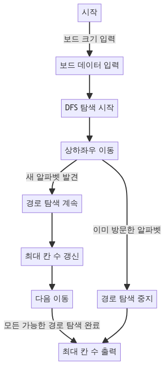

> [CH03_그래프_탐색](../) / [02_DFS](./)

# BOJ_1987 : 알파벳
> https://www.acmicpc.net/problem/1987

## 설계
- (0, 0)부터 시작하여 깊이 우선 탐색(DFS)을 통해 보드의 모든 가능한 경로를 탐색. 이 과정에서 방문한 알파벳은 visited 배열을 통해 기록
- 현재 위치에서 상하좌우로 이동할 수 있는지 확인하고, 방문하지 않은 알파벳으로 이동합니다. 이동할 때마다 경로의 길이(count)를 1씩 증가
- 탐색 중 경로의 최대 길이를 계산하여 max 변수에 저장. 모든 탐색이 끝나면 max에 저장된 값, 즉 최대 경로 길이를 출력

## 구현


## 코드
### Java
```java
// package boj1987;

// https://www.acmicpc.net/problem/1987
import java.util.*;
import java.io.*;

public class Main {

    static int R, C; // 보드의 행과 열 크기
    static char[][] map; // 보드의 알파벳을 저장하는 배열
    static boolean[] visited; // 알파벳의 방문 여부를 저장하는 배열
    static int[] dr = { 0, 0, -1, 1 }; // 상, 하, 좌, 우 방향을 나타내는 행 이동 배열
    static int[] dc = { -1, 1, 0, 0 }; // 상, 하, 좌, 우 방향을 나타내는 열 이동 배열
    static int max = 0; // 지나갈 수 있는 최대 칸 수

    public static void main(String[] args) throws IOException {
        // 입력 처리
        BufferedReader br = new BufferedReader(new InputStreamReader(System.in));
        StringTokenizer st = new StringTokenizer(br.readLine());

        R = Integer.parseInt(st.nextToken()); // 세로 크기 입력
        C = Integer.parseInt(st.nextToken()); // 가로 크기 입력

        map = new char[R][C]; // 보드 초기화
        visited = new boolean[26]; // 알파벳 방문 여부 배열 초기화 (A-Z)

        // 보드의 알파벳 입력
        for (int i = 0; i < R; i++) {
            String str = br.readLine();
            for (int j = 0; j < C; j++)
                map[i][j] = str.charAt(j);
        }

        // DFS 탐색 시작
        dfs(0, 0, 1);

        // 결과 출력
        System.out.println(max);
    }

    static void dfs(int r, int c, int count) {
        max = Math.max(max, count); // 최대 칸 수 갱신
        visited[map[r][c] - 'A'] = true; // 현재 칸의 알파벳 방문 처리

        // 상하좌우 이동 탐색
        for (int i = 0; i < 4; i++) {
            int nr = r + dr[i]; // 다음 행 위치
            int nc = c + dc[i]; // 다음 열 위치

            // 보드 범위를 벗어나거나 이미 방문한 알파벳은 탐색하지 않음
            if (nr < 0 || nr >= R || nc < 0 || nc >= C || visited[map[nr][nc] - 'A'])
                continue;

            dfs(nr, nc, count + 1); // 다음 칸으로 이동하여 탐색
        }

        visited[map[r][c] - 'A'] = false; // 현재 칸의 알파벳 방문 처리 해제
    }
}
```

### Python
```python
import sys
input = sys.stdin.readline

def DFS(graph):
    # 상하좌우로 이동할 수 있는 방향을 나타내는 배열
    dr = [-1, 1, 0, 0]
    dc = [0, 0, -1, 1]

    result = 1
    # 중복 제거를 위한 set을 사용, 시작점과 지나온 알파벳의 문자열 포함
    stack = set([(0, 0, graph[0][0])])
    while stack:
        print(stack)
        r, c, visited = stack.pop()  # 현재 위치와 방문한 알파벳 문자열
        result = max(result, len(visited))  # 최대 이동 거리 갱신
        for i in range(4):
            nr = r + dr[i]  # 다음 행 위치
            nc = c + dc[i]  # 다음 열 위치
            # 보드 내부이고, 새로운 알파벳이라면
            if 0 <= nr < R and 0 <= nc < C:
                if not graph[nr][nc] in visited:
                    # 새로운 위치와 문자열 추가하여 스택에 push
                    stack.add((nr, nc, visited + graph[nr][nc]))
    return result

R, C = map(int, input().split())
board = [input().rstrip() for _ in range(R)]

answer = DFS(board)
print(answer)  # 최종 결과 출력
```