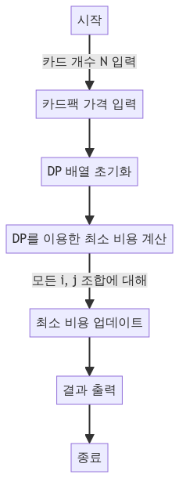

> [CH04_DP_탐욕법](../) / [01_DP](./)

# BOJ_16194 : 카드 구매하기 2
> https://www.acmicpc.net/problem/16194

## 설계
- 기본값 설정: 초기에는 각각의 dp[i]에 P[i]를 할당. 이는 i개 카드를 구매하기 위해 i개가 들어 있는 카드팩을 직접 구매하는 경우의 비용.
- 점화식 적용: i개 카드를 구매하는 데 필요한 최소 비용은 P[i]와 dp[i - j] + P[j] (여기서 j는 1부터 i까지) 중 최소값으로 결정. 이는 i개를 구매하는 여러 가지 방법 중 최소 비용을 찾는 과정.
- 상향식(Bottom-Up) 방식: 작은 문제부터 시작하여 큰 문제를 차례대로 해결

## 구현


## 코드
### Java
```java
package boj16194;

// https://www.acmicpc.net/problem/16194
import java.util.*;
import java.io.*;

public class Main {
    public static void main(String[] args) {
        Scanner sc = new Scanner(System.in);
        int N = sc.nextInt(); // 구매하고자 하는 카드의 개수
        int[] P = new int[N + 1]; // 각 카드팩의 가격을 저장하는 배열
        for (int i = 1; i <= N; i++) {
            P[i] = sc.nextInt(); // 카드팩의 가격 입력
        }

        // 동적 프로그래밍을 위한 배열 초기화
        int[] dp = new int[N + 1];
        for (int i = 1; i <= N; i++) {
            dp[i] = P[i]; // i개 카드가 들어 있는 카드팩을 바로 구매하는 경우의 비용
            for (int j = 1; j <= i; j++) {
                // i개를 구매하는 여러 가지 방법 중 최소 비용을 찾음
                // i-j개를 사는 최솟값에 j개 들어있는 카드팩을 사는 경우를 비교
                dp[i] = Math.min(dp[i], dp[i - j] + P[j]);
            }
        }

        System.out.println(dp[N]); // 최소 비용 출력
        sc.close();
    }
}
```

### Python
```python
N = int(input())  # 구매하고자 하는 카드의 개수
P = [0] + list(map(int, input().split()))  # 각 카드팩의 가격을 저장하는 배열, 인덱스 0은 사용하지 않음
print(P)

dp = [0] * (N + 1)  # 동적 프로그래밍을 위한 배열 초기화
print(dp)

# 동적 프로그래밍을 이용한 문제 해결
for i in range(1, N + 1):
    dp[i] = P[i]  # i개 카드가 들어 있는 카드팩을 바로 구매하는 경우의 비용
    print(dp)
    for j in range(1, i + 1):
        # i개를 구매하는 여러 가지 방법 중 최소 비용을 찾음
        # i-j개를 사는 최솟값에 j개 들어있는 카드팩을 사는 경우를 비교
        dp[i] = min([dp[i], dp[i - j] + P[j]])
    print(dp)

print(dp[N])  # 최소 비용 출력
```