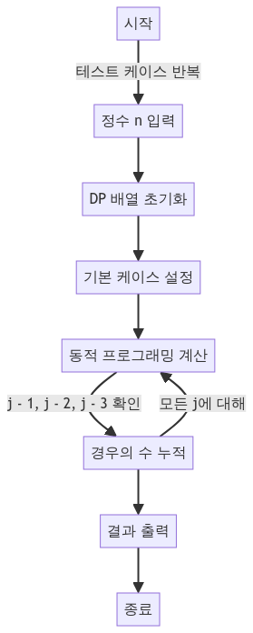

> [CH03_그래프_탐색](../) / [01_그래프_탐색](./)

# BOJ_9095 : 1, 2, 3 더하기
> https://www.acmicpc.net/problem/9095

## 설계
- 동적 프로그래밍은 복잡한 문제를 간단한 여러 개의 하위 문제로 나누어 해결하는 방법. 이미 계산한 하위 문제의 결과를 저장하고 재사용함으로써 계산 효율을 높임.
- 동적 프로그래밍 방식은 중복 계산을 방지하고, 문제를 효율적으로 해결할 수 있게 해줌. 이 문제의 경우, 간단한 **점화식**을 이용하여 n을 만들 수 있는 모든 방법의 수를 구함.
- 이 문제에서는 각 정수 n에 대해, n을 만드는 방법의 수를 저장. n을 만드는 방법은 n-1, n-2, n-3을 만드는 방법의 수에 각각 1, 2, 3을 더하는 것과 동일.
- 하향식(Top-Down)과 상향식(Bottom-Up): 이 코드는 상향식(Bottom-Up) 접근 방식을 사용. 가장 작은 하위 문제부터 시작하여 점차적으로 더 큰 문제를 해결.

## 구현


## 코드
### Java
```java
package boj9095;

// https://www.acmicpc.net/problem/9095
import java.util.*;
import java.io.*;

public class Main {
    public static void main(String[] args) {
        Scanner sc = new Scanner(System.in);
        int T = sc.nextInt(); // 테스트 케이스 개수 입력
        for (int i = 0; i < T; i++) {
            int n = sc.nextInt(); // 정수 n 입력 받음
            int[] dp = new int[n + 1]; // 동적 프로그래밍을 위한 배열 초기화

            // 초기 조건 설정
            dp[0] = 1; // 0을 나타내는 방법은 아무것도 선택하지 않는 것 1가지

            // 동적 프로그래밍을 이용한 문제 해결
            for (int j = 1; j <= n; j++) {
                if (j - 1 >= 0) { // j - 1이 0 이상일 경우
                    dp[j] += dp[j - 1]; // 1을 추가하는 경우의 수
                }
                if (j - 2 >= 0) { // j - 2가 0 이상일 경우
                    dp[j] += dp[j - 2]; // 2를 추가하는 경우의 수
                }
                if (j - 3 >= 0) { // j - 3이 0 이상일 경우
                    dp[j] += dp[j - 3]; // 3을 추가하는 경우의 수
                }
                // System.out.println(Arrays.toString(dp)); // 디버깅
            }
            System.out.println(dp[n]); // 결과 출력
        }
        sc.close();
    }
}
```

### Python
```python
T = int(input())  # 테스트 케이스 개수 입력
print(f'T : {T}')

for _ in range(T):
    n = int(input())  # 정수 n 입력 받음
    print(f'n : {n}')
    dp = [0] * (n + 1)  # 동적 프로그래밍을 위한 배열 초기화

    # 기본값 설정
    if n >= 1: dp[1] = 1  # 1을 만드는 방법: (1)
    if n >= 2: dp[2] = 2  # 2를 만드는 방법: (1+1), (2)
    if n >= 3: dp[3] = 4  # 3을 만드는 방법: (1+1+1), (1+2), (2+1), (3)

    # 동적 프로그래밍을 이용한 문제 해결
    for i in range(4, n + 1):
        dp[i] = dp[i - 1] + dp[i - 2] + dp[i - 3]  # 점화식 적용

    print(dp[n])  # 결과 출력
```