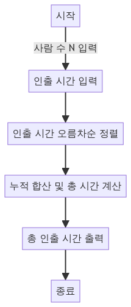

> [CH04_DP_탐욕법](../) / [02_탐욕법](./)

# BOJ_11399 : ATM
> https://www.acmicpc.net/problem/11399

## 설계
- **탐욕법**은 각 단계에서 지역적으로 최적의 선택을 하여, 전체적인 최적해를 찾는 방법.
- 각 사람의 인출 시간을 오름차순으로 정렬하여, 앞에 있는 사람이 먼저 돈을 인출하게 함으로써 전체 대기 시간을 최소화
- 이 방법은 각 사람이 돈을 인출하는데 걸리는 시간이 짧을수록 뒤의 사람들의 대기 시간이 줄어들기 때문에 전체 시간을 최소화할 수 있음.


## 구현


## 코드
### Java
```java
// package boj11399;

// https://www.acmicpc.net/problem/11399
import java.util.*;
import java.io.*;

public class Main {
    public static void main(String[] args) {
        Scanner sc = new Scanner(System.in);
        int N = sc.nextInt(); // 사람의 수
        int[] P = new int[N]; // 각 사람이 돈을 인출하는데 걸리는 시간

        for (int i = 0; i < N; i++) {
            P[i] = sc.nextInt(); // 각 사람의 인출 시간 입력
        }
        sc.close();

        // 인출 시간을 오름차순으로 정렬
        Arrays.sort(P);

        int sum = 0; // 총 인출 시간의 합
        for (int i = 1; i < N; i++) {
            P[i] += P[i - 1]; // i번째 사람의 인출 시간을 누적 합산
            sum += P[i]; // 총 인출 시간의 합 갱신
        }

        // 전체 사람이 돈을 인출하는데 필요한 시간의 합 출력
        System.out.println(sum + P[0]);
    }
}
```

**시간복잡도적인 입장에서의 비교:**
- **조합 코드의 시간복잡도:** 이 코드는 모든 가능한 순서의 조합을 생성하고, 각 조합에 대해 시간 합을 계산. 조합을 생성하는 데에는 `O(N!)` 시간이 걸리고, 각 조합에 대해 시간 합을 계산하는 데에는 O(N^2) 시간이 소요됨. 따라서 총 시간복잡도는 `O(N! * N^2)`로, N이 커지면 계산 시간이 매우 길어짐.
- **탐욕법 코드의 시간복잡도:** 반면, 앞서 설명된 탐욕법 코드는 배열을 오름차순으로 정렬하고 한 번만 순회하여 최소 시간을 계산합니다. 정렬에는 `O(NlogN)` 시간이, 순회에는 `O(N)` 시간이 소요됩니다. 따라서 총 시간복잡도는 `O(NlogN)`로, 훨씬 효율적.

```java
// (참고) 시간 초과 나는 조합 코드
// package boj11399;

// https://www.acmicpc.net/problem/11399
import java.util.*;
import java.io.*;

public class Main {
    static int[] P;  // 각 사람이 돈을 인출하는데 걸리는 시간을 저장하는 배열

    public static void main(String[] args) {
        Scanner sc = new Scanner(System.in);
        int N = sc.nextInt(); // 사람의 수
        P = new int[N]; // 각 사람의 인출 시간 입력

        for (int i = 0; i < N; i++) {
            P[i] = sc.nextInt(); // 각 사람의 인출 시간을 배열에 저장
        }
        sc.close();

        // 모든 조합을 생성하며 최소 인출 시간을 찾음
        combination(new int[N], new boolean[N], 0);
        System.out.println(min); // 최소 인출 시간 출력
    }

    static int min = Integer.MAX_VALUE; // 최소 인출 시간을 저장하는 변수

    // 조합을 생성하는 함수
    static void combination(int[] tmp, boolean[] visited, int depth) {
        if (depth == tmp.length) {
            int sum = 0; // 현재 조합의 인출 시간 합
            for (int i = 0; i < tmp.length; i++) {
                for (int j = 0; j <= i; j++) {
                    sum += P[tmp[j]]; // 각 사람이 인출하는데 걸리는 시간을 더함
                }
            }
            min = Math.min(min, sum); // 최소 인출 시간 갱신
            return;
        }
        for (int i = 0; i < tmp.length; i++) {
            if (visited[i]) continue; // 이미 방문한 경우 스킵
            visited[i] = true; // 방문 표시
            tmp[depth] = i; // 현재 깊이에 i를 저장
            combination(tmp, visited, depth + 1); // 다음 깊이로 재귀 호출
            visited[i] = false; // 방문 표시 해제
        }
    }
}
```

### Python
```python
N = int(input())  # 사람의 수 입력
P = list(map(int, input().split()))  # 각 사람이 돈을 인출하는 데 걸리는 시간 입력
print(N, P)  # 입력된 사람의 수와 각 사람의 인출 시간 출력

P.sort()  # 인출 시간을 오름차순으로 정렬
print(P)  # 정렬된 인출 시간 출력

cost = 0  # 총 인출 시간을 저장할 변수
for i in range(1, N):
    P[i] += P[i-1]  # i번째 사람의 인출 시간은 이전 사람들의 인출 시간의 합과 현재 인출 시간을 합산
    cost += P[i]  # 총 인출 시간에 현재 사람의 인출 시간 합산

print(cost + P[0])  # 첫 번째 사람의 인출 시간과 총 인출 시간의 합을 출력
```